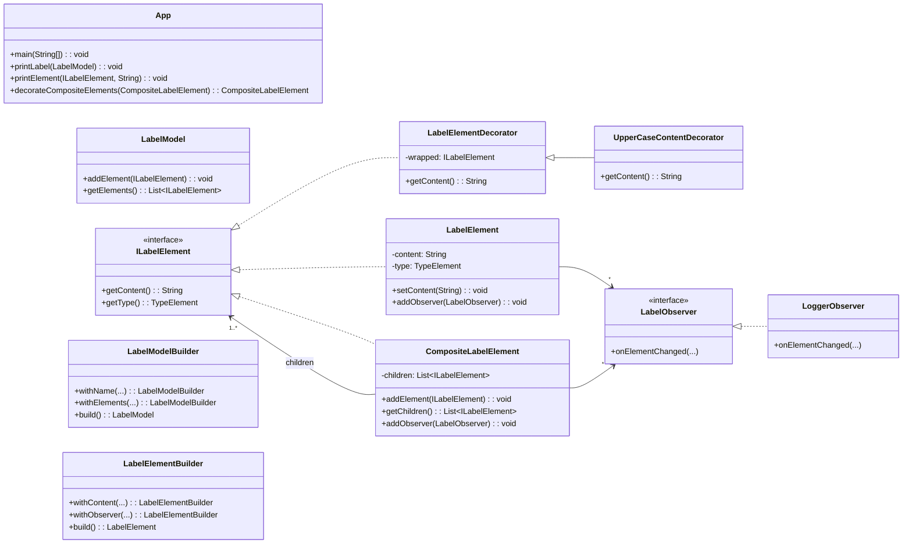
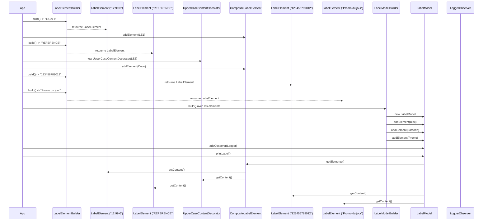

# Description de l'application

L'application développée avec Guillaume permet de modéliser dynamiquement des étiquettes textuelles (`LabelModel`) composées de divers éléments de contenu (`LabelElement`, `TypeElement`, etc.). Chaque étiquette peut être personnalisée en combinant des éléments simples ou composites, et enrichie via des décorateurs de contenu (comme la mise en majuscule).

Le modèle des étiquettes prend également en charge un système d'observation permettant à des classes tierces (comme des loggers) de réagir aux modifications. Cette architecture flexible est conçue pour permettre :

- La construction fluide d’étiquettes via le pattern **Builder**
- L’ajout dynamique de comportement aux éléments via le pattern **Decorator**
- L’organisation hiérarchique d’éléments via le pattern **Composite**
- La réaction aux changements via le pattern **Observer**

Cette application pourrait servir, par exemple, dans un système de génération d’étiquettes personnalisées pour des produits, des documents ou des interfaces utilisateur dynamiques.

# Architecture logicielle globale

L'architecture de l'application repose sur une approche modulaire et extensible, facilitée par l'utilisation de plusieurs design patterns bien établis. Le cœur de l'application est centré autour des modèles d’étiquettes (`LabelModel`), composés d’éléments de texte et de type (`ILabelElement`), qui peuvent être enrichis, observés et composés dynamiquement.

## Flux global

Un `LabelModelBuilder` est utilisé pour construire un `LabelModel` contenant un ou plusieurs `ILabelElement`.

Ces éléments peuvent être simples (`LabelElement`, `TypeElement`), composites (`CompositeLabelElement`) ou décorés (`UpperCaseContentDecorator`).

Lorsqu’un changement est effectué (ajout, suppression, etc.), le `LabelModel` notifie tous les `LabelObserver`.

Les observateurs comme `LoggerObserver` peuvent alors réagir (par exemple, en loggant les modifications).

## Couplage des design patterns

Cette architecture permet :

- Une construction fluide et sécurisée des objets (**Builder**)
- Une hiérarchie extensible d’éléments (**Composite**)
- Un ajout comportemental non-invasif (**Decorator**)
- Une réactivité et séparation des responsabilités (**Observer**)

# Justification claire de l’usage de chaque design pattern

## Builder Pattern

**Classes concernées** : `LabelModelBuilder`, `LabelElementBuilder`

Le Builder Pattern est utilisé pour faciliter la construction progressive et lisible des objets complexes comme `LabelModel` ou `ILabelElement`, en séparant la logique d’assemblage de la logique métier.

**Justification** :
- Créer une syntaxe fluide
- Simplifie la création d’étiquettes complexes avec plusieurs éléments
- Évite les constructeurs à rallonge

## Composite Pattern

**Classes concernées** : `ILabelElement`, `CompositeLabelElement`

Le Composite Pattern permet de traiter de manière uniforme des éléments simples et des groupes d’éléments.

**Justification** :
- Permet de créer des hiérarchies d’éléments de label
- Représente des blocs structurés (ex : adresse complète)
- Facilite l'affichage récursif

## Decorator Pattern

**Classes concernées** : `LabelElementDecorator`, `UpperCaseContentDecorator`

Le Decorator Pattern permet d’ajouter dynamiquement du comportement ou du style à un élément sans modifier sa structure de base.

**Justification** :
- Permet de transformer le texte (ex : tout en majuscule)
- Peut être étendu à la couleur, typographie, etc.
- Évite la multiplication des sous-classes

## Observer Pattern

**Classes concernées** : `LabelObserver`, `LoggerObserver`, `LabelModel`

Le Observer Pattern est utilisé pour permettre à des objets externes de réagir aux modifications d’un `LabelModel`.

**Justification** :
- Découple données et logique de notification
- Permet d’ajouter d’autres observateurs (UI, export...)
- Maintient les composants synchronisés

# Diagramme de classes UML

# Diagramme de séquence : Création d’un LabelModel avec notification

